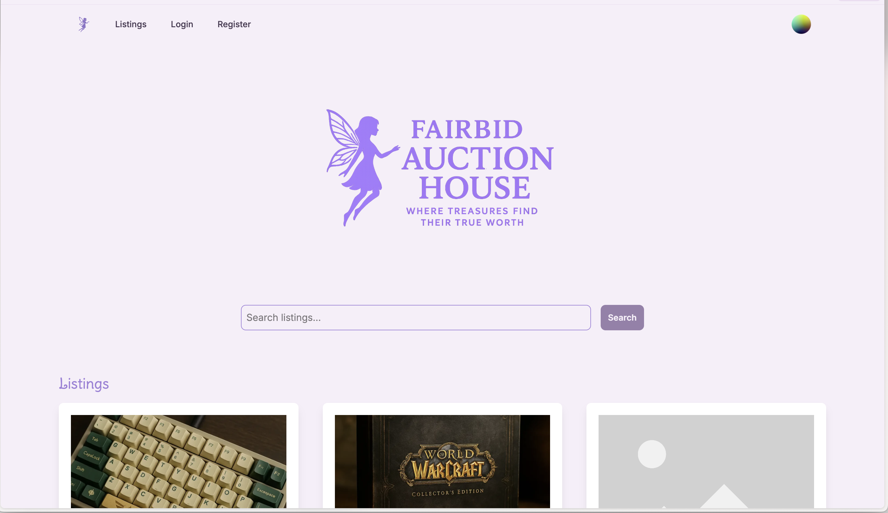

# Semester Project 2 - Auction Site

A React-based auction website where users can browse, bid on, and create auction listings.

## Quick Start

### 1. Install Dependencies
```bash
npm install
```

### 2. Set Up Environment
Create a `.env` file in the root directory:
```
VITE_API_URL=https://v2.api.noroff.dev
VITE_API_KEY=your-api-key-here
```
Get your API key from [Noroff API Documentation](https://docs.noroff.dev/).

### 3. Run the Project
```bash
npm run dev
```
Open http://localhost:5173 in your browser.

## Features

- **Browse Listings**: View active auctions with images and descriptions
- **Search**: Find listings by keywords
- **Authentication**: Register and login to access full features
- **Bidding**: Place bids on items (login required)
- **Create Listings**: Add new auction items (login required)
- **User Profile**: View your listings, wins, and credits

## Technologies

- React 19
- React Router 6
- Tailwind CSS
- Headless UI
- Vite

## Build for Production

```bash
npm run build
```
Deploy the `dist/` folder to Netlify or any static hosting service.

## For Testers

1. **Setup**: Follow Quick Start above
2. **Test User Registration**: Try creating a new account
3. **Test Login**: Login with registered credentials
4. **Test Bidding**: Login and place a bid on an active listing
5. **Test Create Listing**: Go to profile page and create a new auction
6. **Check Errors**: Try invalid actions like bidding without login
7. **Mobile Test**: Check responsiveness on mobile devices
8. **API Errors**: Test behavior when API is unavailable

## Project Structure

- `src/routes/` - Page components (Home, Listings, Profile, etc.)
- `src/components/` - Reusable components
- `public/` - Static assets
- `app/` - App router structure

## API

Uses Noroff Auction API v2. All authenticated requests need Bearer token and API key headers.

--
# Semester Project 2 - Auction site


A React-based auction website where users can browse, bid on, and create auction listings.

## Description

This project was created as part of **Semester Project 2**.  
It is a fully functional auction platform built with React, featuring user authentication, bidding, listing creation, and profile management.

## Features

- **Browse Listings**: View active auctions with images and descriptions
- **Search**: Find listings by keywords
- **Authentication**: Register and login to access full features
- **Bidding**: Place bids on items (login required)
- **Create Listings**: Add new auction items (login required)
- **User Profile**: View your listings, wins, and credits

## Build for Production

```bash
npm run build
```
Deploy the `dist/` folder to Netlify or any static hosting service.

## For Testers

1. **Setup**: Follow Quick Start above
2. **Test User Registration**: Try creating a new account
3. **Test Login**: Login with registered credentials
4. **Test Bidding**: Login and place a bid on an active listing
5. **Test Create Listing**: Go to profile page and create a new auction
6. **Check Errors**: Try invalid actions like bidding without login
7. **Mobile Test**: Check responsiveness on mobile devices
8. **API Errors**: Test behavior when API is unavailable
## Built With

- **React 19**  
- **React Router 6**  
- **Tailwind CSS**  
- **Headless UI**  
- **Vite**  

## Getting Started


### Installing


## Quick Start
### Clone the repo:

```bash
git clone https://github.com/FiaAddow/Semester-project-2.git

```

### 1. Install Dependencies
```bash
npm install
```

### 2. Set Up Environment
Create a `.env` file in the root directory:
```
VITE_API_URL=https://v2.api.noroff.dev
VITE_API_KEY=your-api-key-here
```
Get your API key from [Noroff API Documentation](https://docs.noroff.dev/).

### 3. Run the Project

```bash
npm run build
```
Deploy the `dist/` folder to Netlify or any static hosting service.

### For Testers

1. **Setup**: Follow Quick Start above
2. **Test User Registration**: Try creating a new account
3. **Test Login**: Login with registered credentials
4. **Test Bidding**: Login and place a bid on an active listing
5. **Test Create Listing**: Go to profile page and create a new auction
6. **Check Errors**: Try invalid actions like bidding without login
7. **Mobile Test**: Check responsiveness on mobile devices
8. **API Errors**: Test behavior when API is unavailable

### Project Structure

- `src/routes/` - Page components (Home, Listings, Profile, etc.)
- `src/components/` - Reusable components
- `public/` - Static assets
- `app/` - App router structure

### API

Uses Noroff Auction API v2. All authenticated requests need Bearer token and API key headers.

## Contributing

Fork the repository

Create a feature branch

Make your changes

Push your branch

Open a Pull Request

## Contact

If you wish to reach me, you can contact me here:

**Email:** Farhia.dahir.addow@gmail.com


## Acknowledgments

Special thanks to Noroff and the Noroff API team for providing clear documentation and the Auction API.